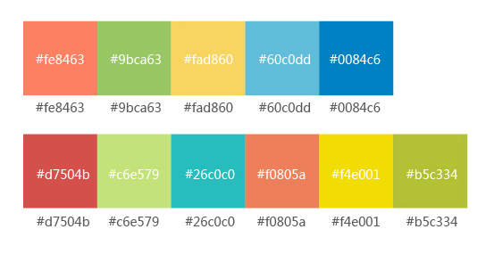
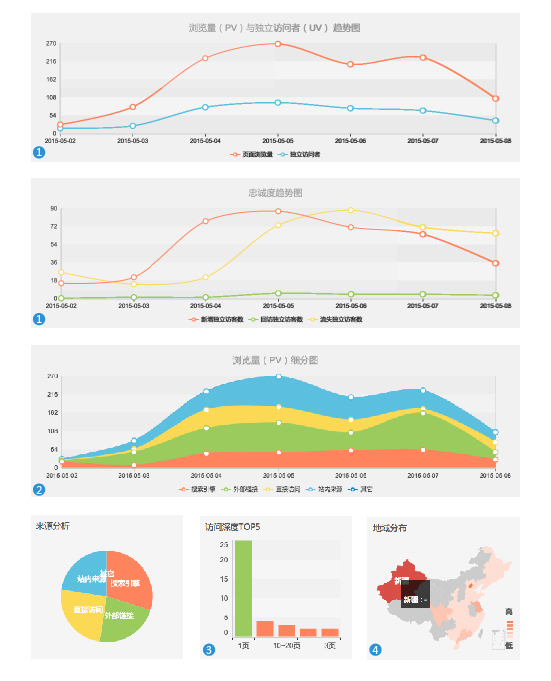

# 图表用色规范

#####以上为图表色彩使用顺序，图表底色#f5f5f5
#####特殊说明，参看下图实例
1. 折线图与折线堆积图，当只有两项内容时，用#fe8463和#0084c6。 
    其余的按照上面色彩排列顺序进行。
2. 折线堆积图，数据区域颜色透明度为1。
3. 单色的柱状图，请使用 #fe8463，仪表盘中的柱状图，排第一位的为#9bca63。
4. 地图的数值色彩范围用color:['#fe8463','#ffede8']，鼠标经过颜色#d7504b。
5. 图表中未选中的数据图形的色彩为灰色 #dddddd。

 
 
---

