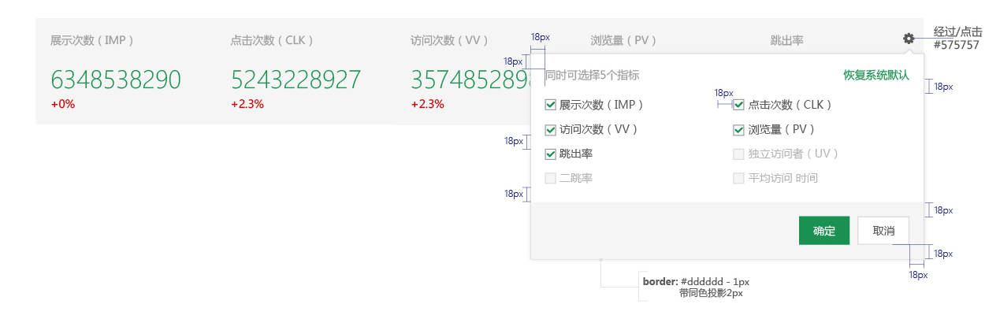

# 看板

* 汇总看板里一次最多显示5个汇总指标，超出的不予显示，并由自定义按钮进行显示隐藏控制。
* 如总数不超过5个指标，不显示自定义按钮。
* 自定义按钮不占空间，浮于会总览右上方，距边界10px。
* 对比数据字段可以不出现。

 

* 点击自定义按钮，展开筛选控件。
* 汇总指标一行两列等分展示。
* 控件最小宽500px，两列指标间距18px，当指标文字长度增加，自动撑开。
* 当勾选满5项后，剩余的指标为不可选状态。
* 必须保留一个项目选择，不可一个都不勾选

 
---
####各种情况

* 当汇总指标少于5个，指标分散撑开，等分显示。
* 数据为空时，对比数据以“0”显示：#575757, 14px。
* 对比数据增长值为“+0%”时，用红色显示。

 

* 当只有一个指标时，左对齐于汇总栏显示。

 

* 汇总看板没抓取到数据时，用两个短横杠表示。

 
 
---

