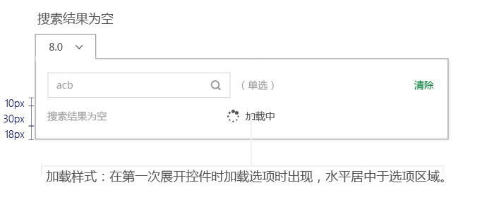

# 筛选器

####单选筛选器

* 选择完成后，控件显示被选项的名称，
* 如果过过长，按照列表展示的截取方式截取字段。
* 选项横向排列，一行4列，超过5行列表出现滚动条

* 选项 
字体原始：14px, #575757 
字体经过：14px, #575757, (bg color@100) 
字体选中：14px, #ffffff, (bg color@500)

 
---
####多选筛选器

* 选择完成后，控件名称不变化，
* 并在控件下方出现提示框，显示被筛选的项目。

* 选项 
字体原始：14px, #575757  
字体经过：14px, #575757, (bg color @100) 
字体选中：14px, #ffffff, (bg color @500)

* 提示框 
框高：40px, (bg color #f5f5f5)  
字体：(选中项目）14px, #@500, Bold  
字体：(其他文字）14px, #575757

 
 
---

