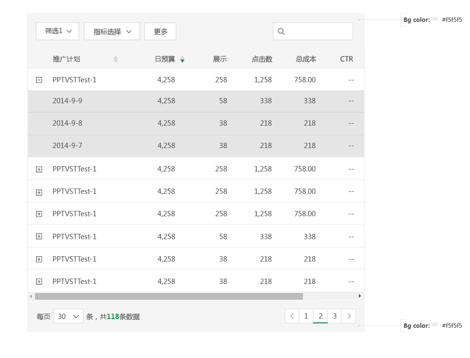
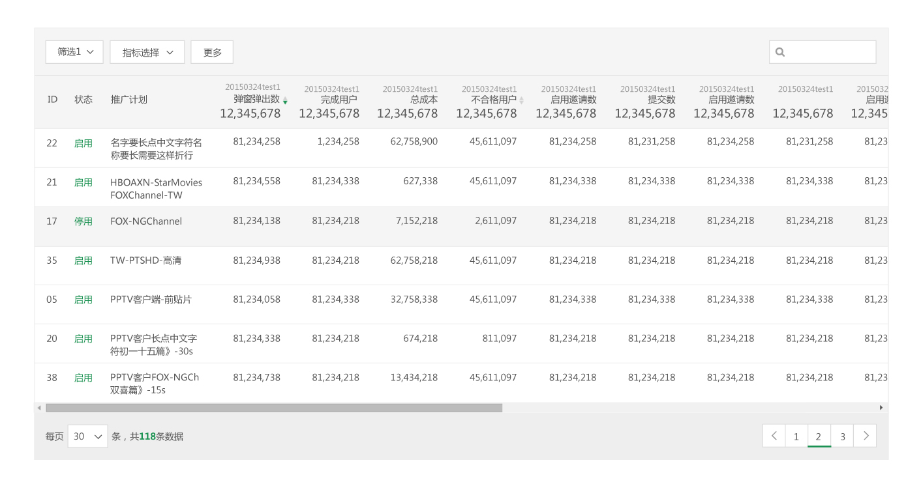

# 表格

####原始

####展开

 
---
####两行表头样式

* 表格的表头，两行行内容，单行文字行高都为1.4，之间不再空行。
* 表头文字：第一行 14px, #575757，第二行 20px, #575757。

####三行表头样式

* 表格的表头，三行内容，单行文字行高都为1.4，之间不再空行。
* 表头文字：第一行 12px, #9f9f9f，第二行 14px, #575757，第三行 20px, #575757。

 
---
####完整展示

- 当某一单元格数据折行后，同行的其余单元格中的数据于单元格顶部对齐。

 
 
---

