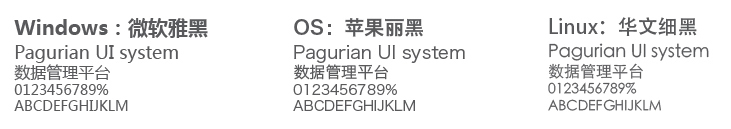

# 文字

####字体：
 * 中英文字体默认使用：微软雅黑
 * **font-family:** "Microsoft YaHei", "微软雅黑", "Hiragino Sans GB", "苹果丽黑", "STXihei", "华文细黑", San-serif;

---
####字号及颜色：
 * 默认字号: 14px
 * 默认色彩:     #575757
 * 弱化色彩:     #9f9f9f
 * 反色色彩:     #ffffff
 * 警告色彩:     #ff0000
 * 强调色彩: 跟随个系统主色
 * 在强调时需+Bold

---
####段落
行高：1.4
 
 
---

