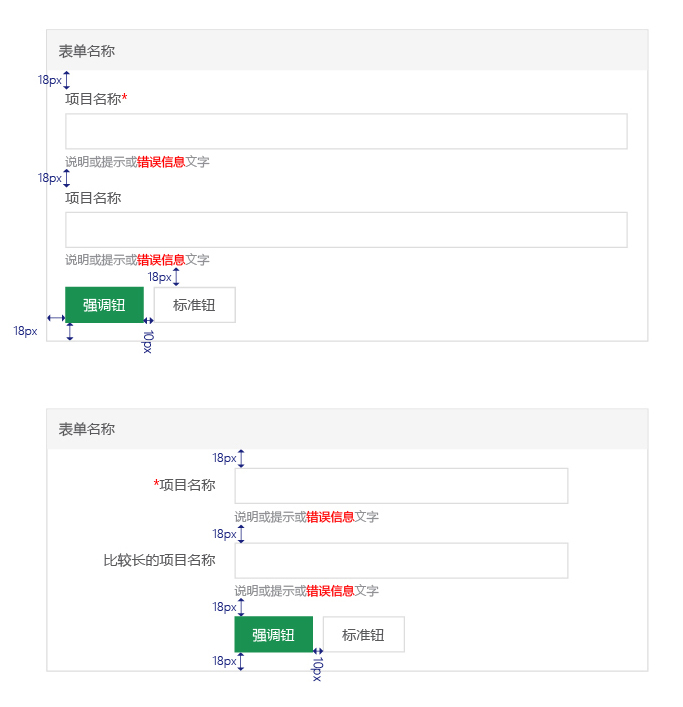

# 表单

各组件上下间距是18px，以间隔各组件，使布局整齐有序。
 表单按钮距边距18px，相互间距10px。

**以下是两种表单结构组件：**
 

**以下是两种结构的一个表现样式：**
 

###*两个样式不可同时出现在同一个系统中。
 
---
####表单实际效果
* 框架边框： #dddddd, 1px
* 头部的灰色：#f5f5f5
* 头部高：40px
* 头部名称字号：14px

* 必填项：在名称上加红色星号，字号同大
* 选填项：如果全是必填，选填的那项在提示文字信息做出提示

* 表单头部的名称如果没有可以不显示，并去掉灰底。
* 提交控件与输入框左对齐。

*左右结构表单样式（上图），页面级的固定框架宽度：1080px。
当页面无左侧菜单，或页面大于1366px宽度后，左右结构的表单
任然是在1080px宽度下的比例。

 
 
---

